# Chronos Rewards - システムアーキテクチャ & データフロー図
Version: 1.0  
Date: 2026-01-31

このドキュメントはMermaid記法を使用しています。VSCode（Markdown Preview Mermaid Support拡張機能）またはGitHubで自動的に図として表示されます。

---

## 1. システムアーキテクチャ図

### 1.1 全体構成

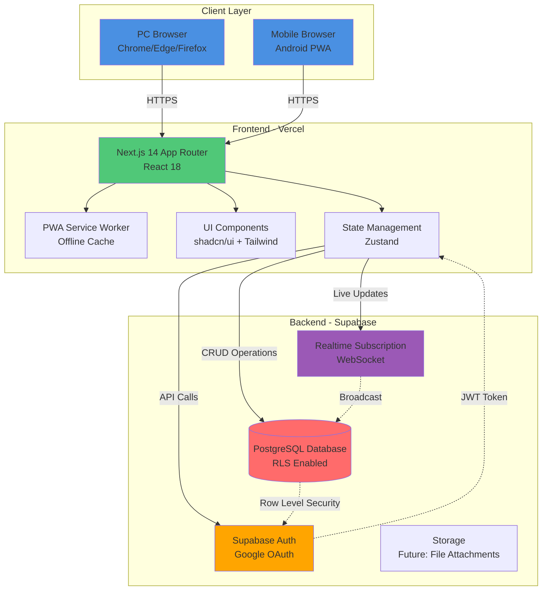

---

### 1.2 レイヤー別詳細

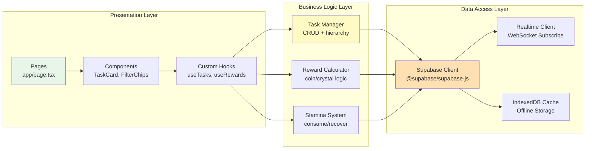

---

## 2. データフロー図

### 2.1 タスク作成フロー

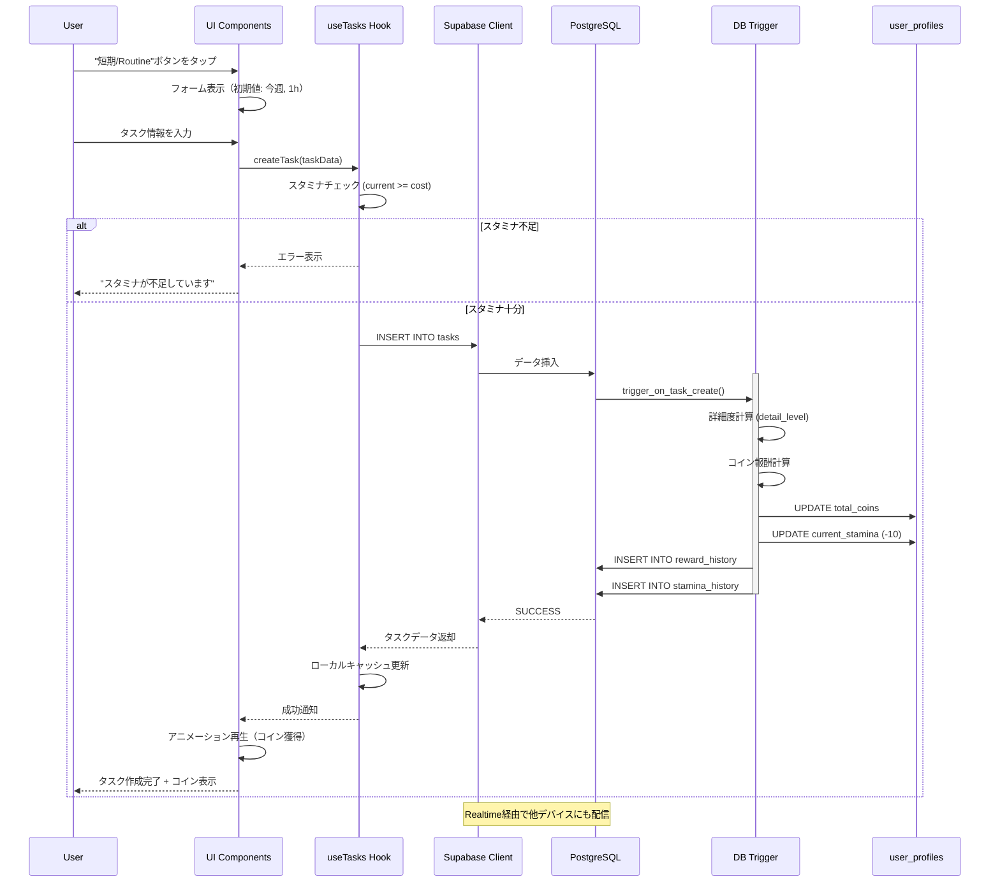

---

### 2.2 タスク完了フロー

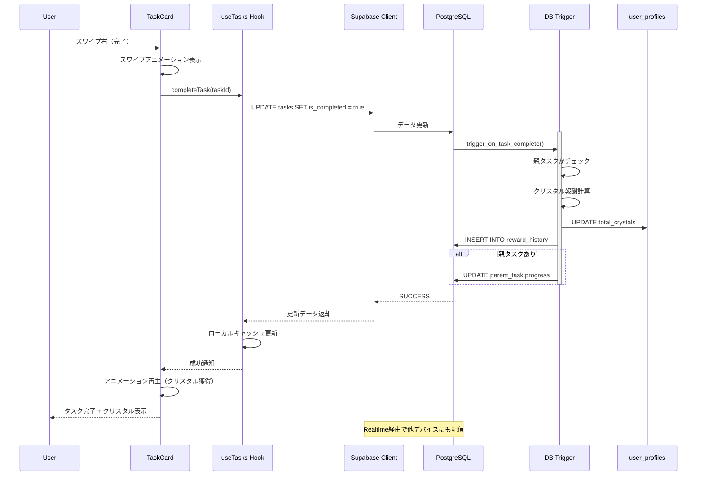

---

### 2.3 リアルタイム同期フロー（PC ↔ Mobile）

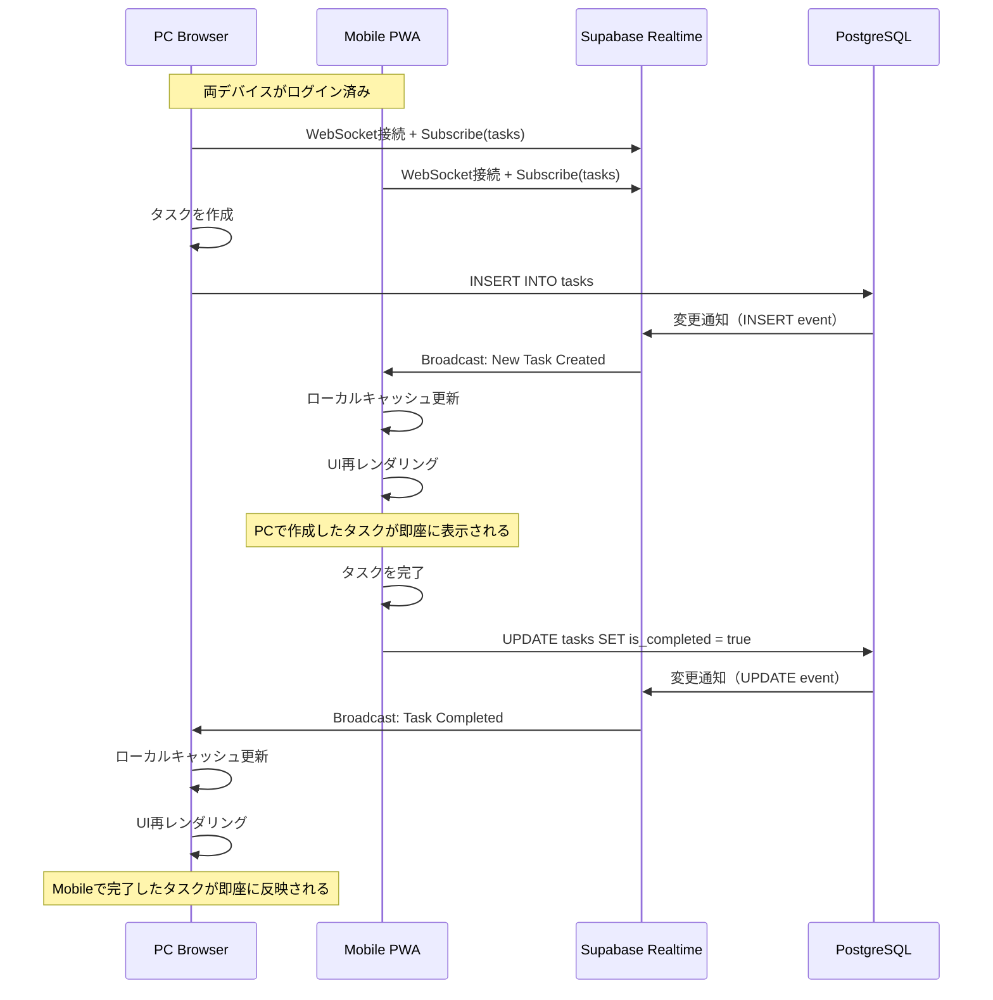

---

### 2.4 オフライン対応フロー

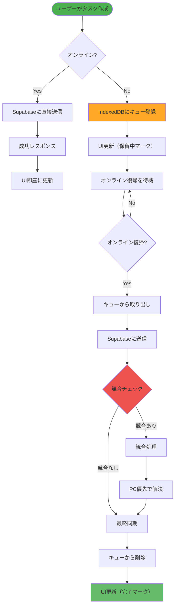

---

### 2.5 報酬計算フロー

```mermaid
flowchart TD
    TaskCreate[タスク作成]
    CalcDetail[詳細度計算<br/>calculate_detail_level]
    
    CheckDesc{description<br/>10文字以上?}
    CheckBenefit{benefits<br/>10文字以上?}
    CheckChecklist{checklist<br/>3個以上?}
    CheckHours{estimated_hours<br/>10h以上?}
    
    DetailLevel[detail_level決定<br/>1-5]
    
    CalcCoin[コイン報酬計算<br/>calculate_coin_reward]
    BaseCoin[基本: 10コイン]
    
    MultDetail[詳細度倍率<br/>1.0 + level-1 × 0.25]
    MultPrereq{前提条件あり?}
    MultBenefit{メリットあり?}
    
    FinalCoin[最終コイン = FLOOR基本 × 倍率]
    
    ConsumeStamina[スタミナ消費<br/>基本10 + 追加]
    RewardUser[user_profilesに反映]
    LogHistory[reward_historyに記録]
    
    TaskCreate --> CalcDetail
    CalcDetail --> CheckDesc
    CheckDesc -->|Yes +1| CheckBenefit
    CheckDesc -->|No| CheckBenefit
    CheckBenefit -->|Yes +1| CheckChecklist
    CheckBenefit -->|No| CheckChecklist
    CheckChecklist -->|Yes +1| CheckHours
    CheckChecklist -->|No| CheckHours
    CheckHours -->|Yes +1| DetailLevel
    CheckHours -->|No| DetailLevel
    
    DetailLevel --> CalcCoin
    CalcCoin --> BaseCoin
    BaseCoin --> MultDetail
    MultDetail --> MultPrereq
    MultPrereq -->|Yes ×1.2| MultBenefit
    MultPrereq -->|No| MultBenefit
    MultBenefit -->|Yes ×1.2| FinalCoin
    MultBenefit -->|No| FinalCoin
    
    FinalCoin --> ConsumeStamina
    ConsumeStamina --> RewardUser
    RewardUser --> LogHistory
    
    style TaskCreate fill:#42A5F5
    style DetailLevel fill:#FFA726
    style FinalCoin fill:#66BB6A
    style LogHistory fill:#AB47BC
```

---

### 2.6 スタミナ回復フロー

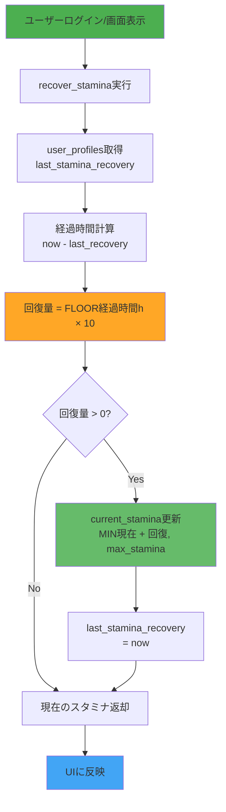

---

## 3. 画面遷移図

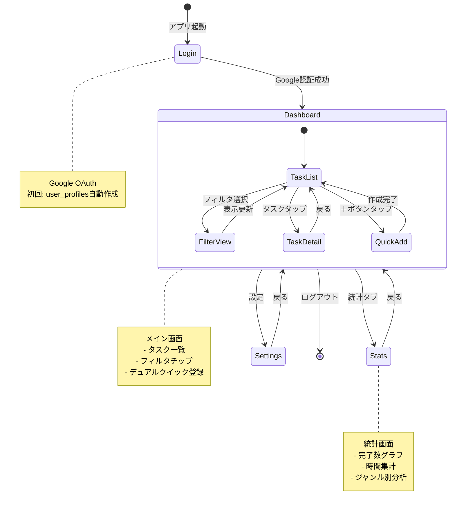

---

## 4. コンポーネント構成図

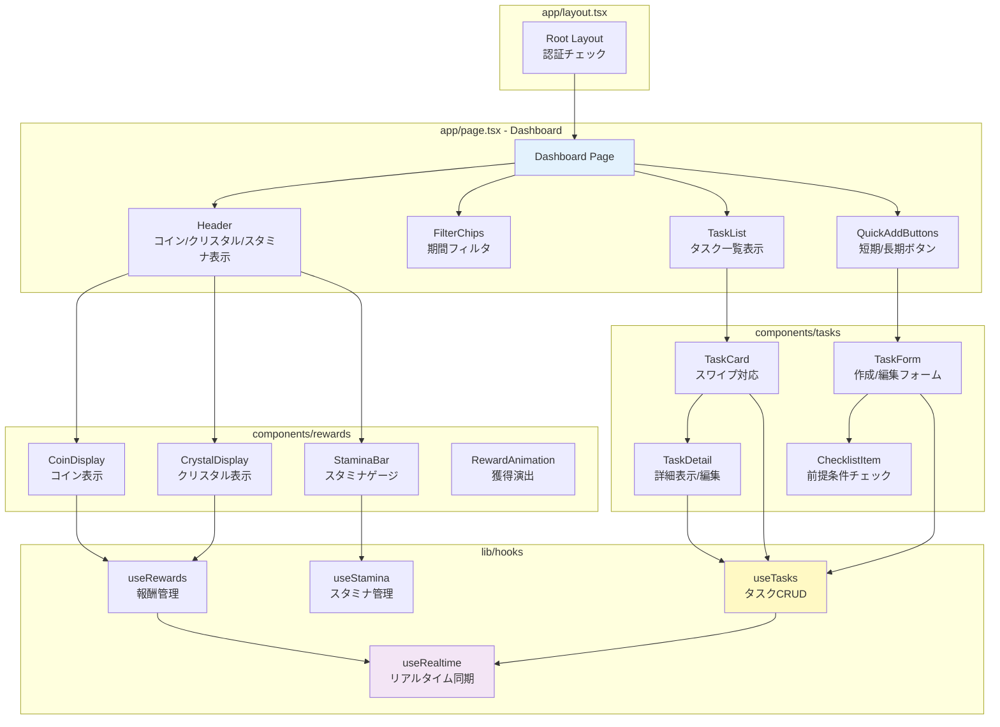

---

## 5. データベーストリガー処理フロー

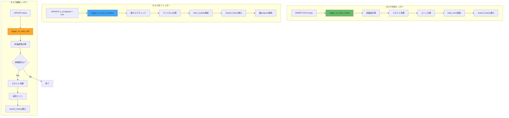

---

## 6. PWA オフライン戦略

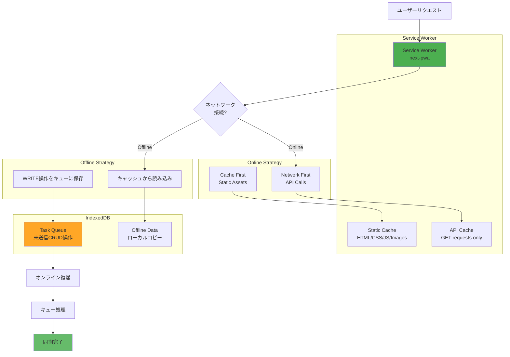

---

## 7. セキュリティフロー（RLS）

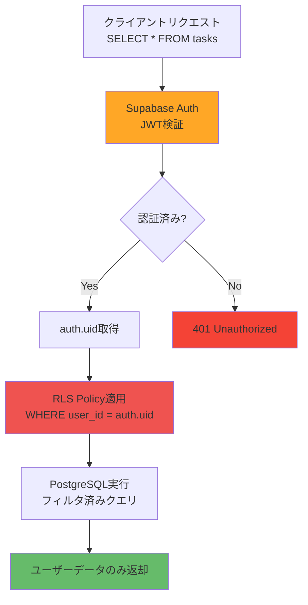

---

## 8. 主要処理フロー詳細

### 8.1 アプリ起動時の初期化フロー

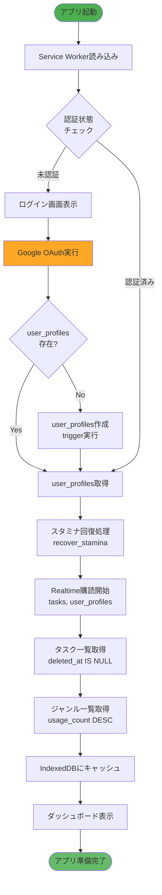

---

### 8.2 フィルタリング処理フロー

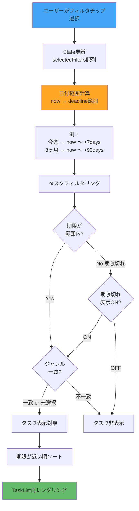

---

### 8.3 ジャンル管理フロー

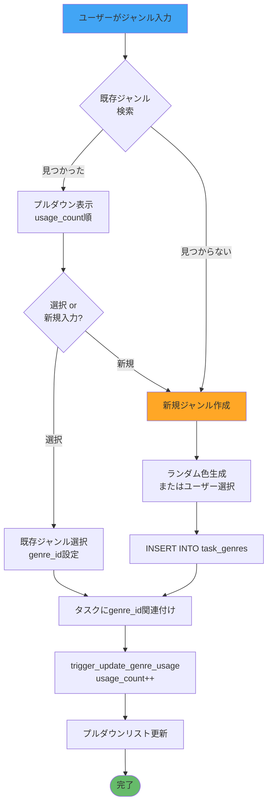

---

### 8.4 親子タスク作成・管理フロー

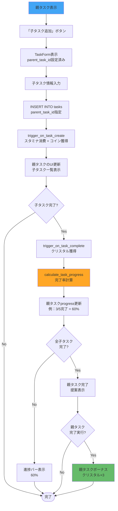

---

### 8.5 スワイプ操作処理フロー

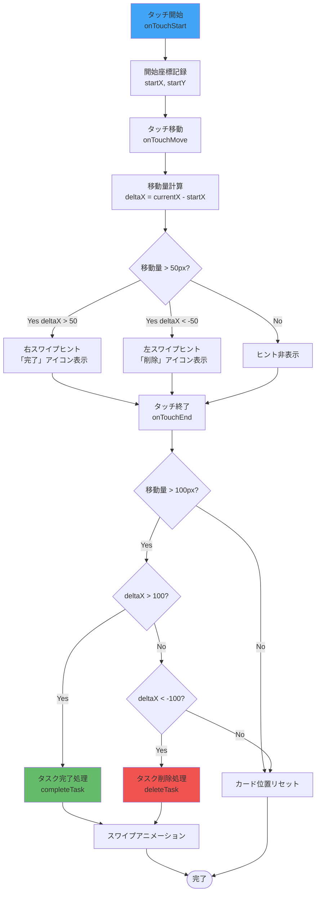

---

### 8.6 報酬アニメーション処理フロー

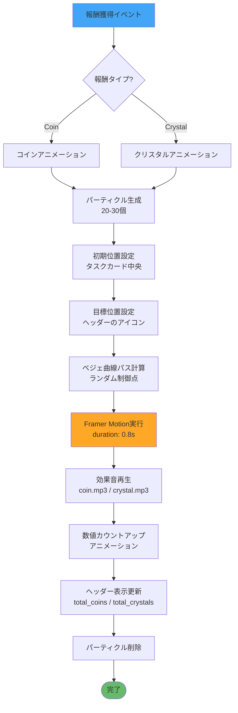

---

### 8.7 統計画面データ集計フロー

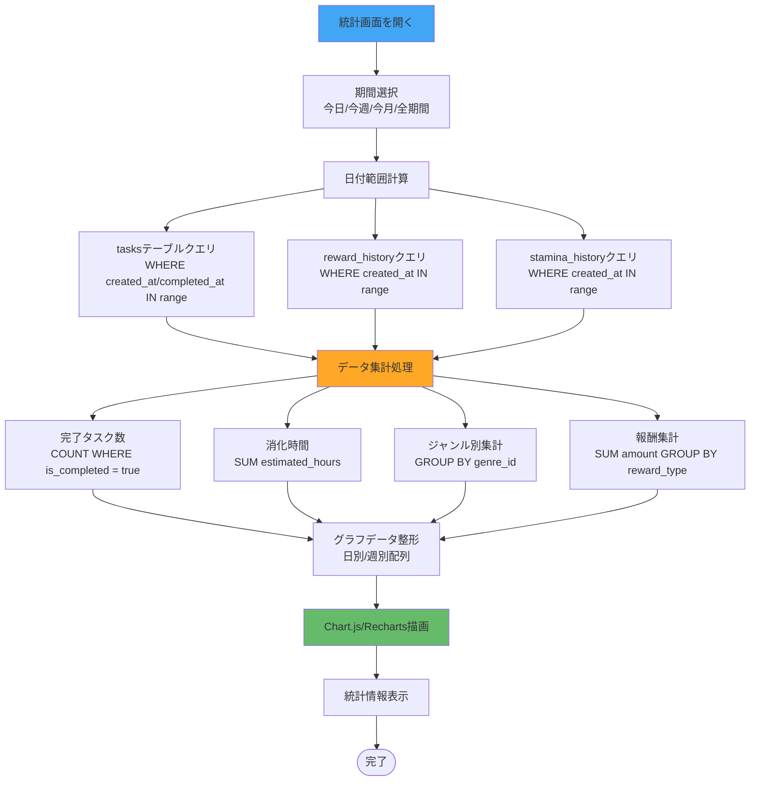

---

### 8.8 エラーハンドリングフロー

```mermaid
flowchart TD
    Operation[ユーザー操作]
    
    TryCatch[try-catch実行]
    
    CheckError{エラー発生?}
    
    Success[正常処理]
    
    ErrorType{エラー種別?}
    
    StaminaError[スタミナ不足エラー]
    NetworkError[ネットワークエラー]
    AuthError[認証エラー]
    ValidationError[バリデーションエラー]
    DBError[データベースエラー]
    UnknownError[その他のエラー]
    
    ShowStaminaToast[Toast表示<br/>「スタミナが不足しています」]
    ShowNetworkToast[Toast表示<br/>「オフライン：後で同期されます」]
    RedirectLogin[ログイン画面へリダイレクト]
    ShowValidationMsg[フォームエラー表示<br/>該当フィールドハイライト]
    ShowDBToast[Toast表示<br/>「エラーが発生しました」]
    ShowGenericToast[Toast表示<br/>「予期しないエラー」]
    
    LogError[エラーログ記録<br/>Sentry/Console]
    
    QueueRetry{リトライ可能?}
    
    AddToQueue[オフラインキューに追加]
    
    RollbackUI[UI状態をロールバック]
    
    Done([完了])
    
    Operation --> TryCatch
    TryCatch --> CheckError
    
    CheckError -->|No| Success
    CheckError -->|Yes| ErrorType
    
    Success --> Done
    
    ErrorType -->|スタミナ不足| StaminaError
    ErrorType -->|ネットワーク| NetworkError
    ErrorType -->|認証| AuthError
    ErrorType -->|バリデーション| ValidationError
    ErrorType -->|DB| DBError
    ErrorType -->|その他| UnknownError
    
    StaminaError --> ShowStaminaToast
    NetworkError --> ShowNetworkToast
    AuthError --> RedirectLogin
    ValidationError --> ShowValidationMsg
    DBError --> ShowDBToast
    UnknownError --> ShowGenericToast
    
    ShowStaminaToast --> LogError
    ShowNetworkToast --> QueueRetry
    RedirectLogin --> LogError
    ShowValidationMsg --> Done
    ShowDBToast --> LogError
    ShowGenericToast --> LogError
    
    QueueRetry -->|Yes| AddToQueue
    QueueRetry -->|No| LogError
    
    AddToQueue --> Done
    
    LogError --> RollbackUI
    RollbackUI --> Done
    
    style Operation fill:#42A5F5
    style ErrorType fill:#EF5350
    style Done fill:#66BB6A
```

---

## 8. 処理フロー図（ユースケース別）

### 8.1 アプリ起動〜ダッシュボード表示

```mermaid
flowchart TD
    Start([アプリ起動])
    CheckAuth{認証状態<br/>確認}
    
    LoginPage[ログイン画面表示]
    GoogleAuth[Google OAuth実行]
    CreateProfile{user_profiles<br/>存在?}
    
    AutoCreate[トリガーで自動作成<br/>handle_new_user]
    
    RecoverStamina[スタミナ回復処理<br/>recover_stamina]
    
    FetchTasks[タスク一覧取得<br/>SELECT tasks]
    FetchProfile[プロフィール取得<br/>SELECT user_profiles]
    
    SubscribeRealtime[Realtime購読開始<br/>WebSocket接続]
    
    RenderDashboard[ダッシュボード表示]
    
    LoadCache{キャッシュ<br/>あり?}
    ShowCache[キャッシュから即座に表示]
    ShowLoading[ローディング表示]
    
    Start --> CheckAuth
    
    CheckAuth -->|未認証| LoginPage
    CheckAuth -->|認証済み| LoadCache
    
    LoginPage --> GoogleAuth
    GoogleAuth --> CreateProfile
    
    CreateProfile -->|No| AutoCreate
    CreateProfile -->|Yes| RecoverStamina
    AutoCreate --> RecoverStamina
    
    LoadCache -->|Yes| ShowCache
    LoadCache -->|No| ShowLoading
    
    ShowCache --> RecoverStamina
    ShowLoading --> RecoverStamina
    
    RecoverStamina --> FetchProfile
    FetchProfile --> FetchTasks
    FetchTasks --> SubscribeRealtime
    SubscribeRealtime --> RenderDashboard
    
    style Start fill:#4CAF50
    style GoogleAuth fill:#FFA726
    style RenderDashboard fill:#66BB6A
```

---

### 8.2 フィルタリング処理

```mermaid
flowchart TD
    UserClick[ユーザーがフィルタチップクリック]
    
    GetCurrentFilters[現在のフィルタ状態取得]
    
    ToggleFilter{同じフィルタ<br/>再クリック?}
    
    RemoveFilter[フィルタ削除]
    AddFilter[フィルタ追加]
    
    CalcDateRange[日付範囲計算<br/>今日/今週/3ヶ月等]
    
    FilterTasks[タスクをフィルタリング<br/>WHERE deadline BETWEEN]
    
    CheckOverdue{期限切れ<br/>表示ON?}
    
    IncludeOverdue[期限切れも含める]
    ExcludeOverdue[期限切れ除外]
    
    SortByDeadline[期限が近い順にソート<br/>ORDER BY deadline ASC]
    
    UpdateUI[UI再レンダリング]
    
    UserClick --> GetCurrentFilters
    GetCurrentFilters --> ToggleFilter
    
    ToggleFilter -->|Yes| RemoveFilter
    ToggleFilter -->|No| AddFilter
    
    RemoveFilter --> CalcDateRange
    AddFilter --> CalcDateRange
    
    CalcDateRange --> FilterTasks
    FilterTasks --> CheckOverdue
    
    CheckOverdue -->|Yes| IncludeOverdue
    CheckOverdue -->|No| ExcludeOverdue
    
    IncludeOverdue --> SortByDeadline
    ExcludeOverdue --> SortByDeadline
    
    SortByDeadline --> UpdateUI
    
    style UserClick fill:#42A5F5
    style CalcDateRange fill:#FFA726
    style UpdateUI fill:#66BB6A
```

---

### 8.3 デュアルクイック登録処理

```mermaid
flowchart TD
    UserClick[ユーザーが＋ボタンクリック]
    
    CheckButton{どちらの<br/>ボタン?}
    
    ShortTerm[短期/Routine<br/>初期値設定]
    LongTerm[長期/Project<br/>初期値設定]
    
    SetDeadlineShort[時限: 今週<br/>7日後の日付]
    SetHoursShort[重さ: 1h]
    
    SetDeadlineLong[時限: 3ヶ月<br/>90日後の日付]
    SetHoursLong[重さ: 10h]
    
    ShowForm[フォーム表示<br/>初期値入力済み]
    
    UserInput[ユーザーが入力<br/>タスク名/ジャンル等]
    
    CheckGenre{ジャンル入力<br/>開始?}
    
    FetchGenres[既存ジャンル取得<br/>SELECT task_genres<br/>ORDER BY usage_count]
    ShowDropdown[プルダウン表示]
    
    SelectOrCreate{既存選択 or<br/>新規入力?}
    
    SelectExisting[既存ジャンル選択]
    CreateNew[新規ジャンル作成<br/>INSERT task_genres]
    
    Validate{入力検証<br/>タスク名必須}
    
    ShowError[エラー表示]
    
    CheckStamina{スタミナ<br/>十分?}
    
    CalculateCost[必要スタミナ計算<br/>基本10 + 詳細度]
    
    CreateTask[タスク作成処理<br/>→ Section 2.1参照]
    
    CloseForm[フォーム閉じる]
    ShowSuccess[成功通知 + アニメーション]
    
    UserClick --> CheckButton
    
    CheckButton -->|短期| ShortTerm
    CheckButton -->|長期| LongTerm
    
    ShortTerm --> SetDeadlineShort
    SetDeadlineShort --> SetHoursShort
    SetHoursShort --> ShowForm
    
    LongTerm --> SetDeadlineLong
    SetDeadlineLong --> SetHoursLong
    SetHoursLong --> ShowForm
    
    ShowForm --> UserInput
    
    UserInput --> CheckGenre
    
    CheckGenre -->|Yes| FetchGenres
    CheckGenre -->|No| Validate
    
    FetchGenres --> ShowDropdown
    ShowDropdown --> SelectOrCreate
    
    SelectOrCreate -->|既存| SelectExisting
    SelectOrCreate -->|新規| CreateNew
    
    SelectExisting --> Validate
    CreateNew --> Validate
    
    Validate -->|NG| ShowError
    ShowError --> UserInput
    
    Validate -->|OK| CalculateCost
    CalculateCost --> CheckStamina
    
    CheckStamina -->|不足| ShowError
    CheckStamina -->|十分| CreateTask
    
    CreateTask --> CloseForm
    CloseForm --> ShowSuccess
    
    style UserClick fill:#42A5F5
    style CheckStamina fill:#EF5350
    style ShowSuccess fill:#66BB6A
```

---

### 8.4 親子タスク作成処理

```mermaid
flowchart TD
    UserAction[ユーザーが親タスクから<br/>子タスク作成を選択]
    
    GetParentInfo[親タスク情報取得<br/>parent_task_id設定]
    
    ShowForm[子タスクフォーム表示]
    
    InheritGenre{ジャンル<br/>継承?}
    
    CopyGenre[親のジャンルを初期値に]
    EmptyGenre[空欄]
    
    SuggestDeadline[親の期限より前を推奨<br/>バリデーション]
    
    UserInput[ユーザー入力]
    
    ValidateDeadline{期限が親より<br/>未来?}
    
    ShowWarning[警告表示<br/>続行は可能]
    
    CreateChildTask[子タスク作成<br/>parent_task_id設定]
    
    UpdateParentProgress[親タスク進捗更新<br/>calculate_task_progress]
    
    CountChildren[子タスク数カウント]
    CountCompleted[完了子タスク数カウント]
    
    CalcProgress[進捗率 = <br/>完了数 / 総数 × 100]
    
    UpdateDB[親タスクUPDATE<br/>completion_progress]
    
    ShowSuccess[成功通知]
    RefreshUI[UI更新<br/>親子関係表示]
    
    UserAction --> GetParentInfo
    GetParentInfo --> ShowForm
    
    ShowForm --> InheritGenre
    
    InheritGenre -->|Yes| CopyGenre
    InheritGenre -->|No| EmptyGenre
    
    CopyGenre --> SuggestDeadline
    EmptyGenre --> SuggestDeadline
    
    SuggestDeadline --> UserInput
    UserInput --> ValidateDeadline
    
    ValidateDeadline -->|Yes| ShowWarning
    ValidateDeadline -->|No| CreateChildTask
    
    ShowWarning --> CreateChildTask
    
    CreateChildTask --> UpdateParentProgress
    
    UpdateParentProgress --> CountChildren
    CountChildren --> CountCompleted
    CountCompleted --> CalcProgress
    CalcProgress --> UpdateDB
    
    UpdateDB --> ShowSuccess
    ShowSuccess --> RefreshUI
    
    style UserAction fill:#42A5F5
    style ValidateDeadline fill:#FFA726
    style RefreshUI fill:#66BB6A
```

---

### 8.5 タスク編集処理

```mermaid
flowchart TD
    UserEdit[ユーザーがタスク編集]
    
    LoadCurrent[現在のタスクデータ取得]
    
    ShowEditForm[編集フォーム表示<br/>既存値入力済み]
    
    UserModify[ユーザーが変更]
    
    DetectChanges[変更箇所検出<br/>old vs new]
    
    CheckCompleted{タスクが<br/>完了済み?}
    
    BlockEdit[編集不可エラー]
    
    CheckDetailImprove{詳細度<br/>向上?}
    
    CalcOldDetail[旧詳細度計算]
    CalcNewDetail[新詳細度計算]
    
    NoBonus[通常更新のみ]
    
    ConsumeStamina[スタミナ消費<br/>5pt]
    
    BonusCoin[追加コイン付与<br/>差分 × 5]
    
    UpdateTask[UPDATE tasks<br/>trigger_on_task_edit実行]
    
    RealtimeNotify[Realtime通知<br/>他デバイスに配信]
    
    UpdateCache[ローカルキャッシュ更新]
    
    ShowSuccess[成功通知]
    RefreshUI[UI更新]
    
    UserEdit --> LoadCurrent
    LoadCurrent --> ShowEditForm
    ShowEditForm --> UserModify
    UserModify --> DetectChanges
    
    DetectChanges --> CheckCompleted
    
    CheckCompleted -->|Yes| BlockEdit
    CheckCompleted -->|No| CheckDetailImprove
    
    CheckDetailImprove --> CalcOldDetail
    CalcOldDetail --> CalcNewDetail
    
    CalcNewDetail --> CheckDetailImprove
    
    CheckDetailImprove -->|No| NoBonus
    CheckDetailImprove -->|Yes| ConsumeStamina
    
    ConsumeStamina --> BonusCoin
    BonusCoin --> UpdateTask
    NoBonus --> UpdateTask
    
    UpdateTask --> RealtimeNotify
    RealtimeNotify --> UpdateCache
    UpdateCache --> ShowSuccess
    ShowSuccess --> RefreshUI
    
    style UserEdit fill:#42A5F5
    style CheckCompleted fill:#EF5350
    style RefreshUI fill:#66BB6A
```

---

### 8.6 タスク削除処理（論理削除）

```mermaid
flowchart TD
    UserDelete[ユーザーがスワイプ左<br/>または削除ボタン]
    
    ShowConfirm[確認ダイアログ表示<br/>本当に削除しますか?]
    
    UserConfirm{ユーザー<br/>確認?}
    
    Cancel[キャンセル]
    
    CheckChildren{子タスク<br/>存在?}
    
    ShowChildWarning[警告表示<br/>子タスクも削除されます]
    
    UserFinalConfirm{続行?}
    
    LogicalDelete[論理削除実行<br/>UPDATE deleted_at = now]
    
    DeleteChildren[子タスクも論理削除<br/>CASCADE]
    
    UpdateParent{親タスク<br/>あり?}
    
    RecalcProgress[親の進捗再計算<br/>削除したタスク除外]
    
    UpdateParentDB[親タスクUPDATE]
    
    RealtimeNotify[Realtime通知]
    
    UpdateCache[ローカルキャッシュ更新]
    
    ShowSuccess[削除完了通知]
    
    FadeOutAnimation[フェードアウト<br/>アニメーション]
    
    RemoveFromUI[UI更新<br/>リストから除去]
    
    UserDelete --> ShowConfirm
    ShowConfirm --> UserConfirm
    
    UserConfirm -->|No| Cancel
    UserConfirm -->|Yes| CheckChildren
    
    CheckChildren -->|Yes| ShowChildWarning
    CheckChildren -->|No| LogicalDelete
    
    ShowChildWarning --> UserFinalConfirm
    
    UserFinalConfirm -->|No| Cancel
    UserFinalConfirm -->|Yes| LogicalDelete
    
    LogicalDelete --> DeleteChildren
    DeleteChildren --> UpdateParent
    
    UpdateParent -->|Yes| RecalcProgress
    UpdateParent -->|No| RealtimeNotify
    
    RecalcProgress --> UpdateParentDB
    UpdateParentDB --> RealtimeNotify
    
    RealtimeNotify --> UpdateCache
    UpdateCache --> ShowSuccess
    ShowSuccess --> FadeOutAnimation
    FadeOutAnimation --> RemoveFromUI
    
    style UserDelete fill:#EF5350
    style ShowChildWarning fill:#FFA726
    style RemoveFromUI fill:#66BB6A
```

---

### 8.7 統計画面表示処理

```mermaid
flowchart TD
    UserNavigate[ユーザーが統計タブをタップ]
    
    ShowLoading[ローディング表示]
    
    FetchStats[統計データ取得<br/>v_task_statistics]
    
    FetchRewards[報酬履歴取得<br/>reward_history]
    
    FetchStamina[スタミナ履歴取得<br/>stamina_history]
    
    CalcPeriod[期間別集計<br/>今日/今週/今月/全期間]
    
    subgraph "タスク統計"
        CountCompleted[完了数]
        CountActive[進行中]
        CountOverdue[期限切れ]
        SumHours[累計時間]
    end
    
    subgraph "報酬統計"
        TotalCoins[累計コイン]
        TotalCrystals[累計クリスタル]
        RewardTimeline[獲得推移グラフ]
    end
    
    subgraph "ジャンル統計"
        GenreBreakdown[ジャンル別完了数]
        GenreHours[ジャンル別時間]
    end
    
    RenderCharts[グラフ描画<br/>Chart.js or Recharts]
    
    RenderTables[テーブル表示<br/>ランキング等]
    
    ShowComplete[統計画面表示完了]
    
    UserNavigate --> ShowLoading
    ShowLoading --> FetchStats
    
    FetchStats --> FetchRewards
    FetchRewards --> FetchStamina
    
    FetchStamina --> CalcPeriod
    
    CalcPeriod --> CountCompleted
    CalcPeriod --> CountActive
    CalcPeriod --> CountOverdue
    CalcPeriod --> SumHours
    
    CalcPeriod --> TotalCoins
    CalcPeriod --> TotalCrystals
    CalcPeriod --> RewardTimeline
    
    CalcPeriod --> GenreBreakdown
    CalcPeriod --> GenreHours
    
    SumHours --> RenderCharts
    RewardTimeline --> RenderCharts
    GenreBreakdown --> RenderCharts
    
    CountCompleted --> RenderTables
    GenreHours --> RenderTables
    
    RenderCharts --> ShowComplete
    RenderTables --> ShowComplete
    
    style UserNavigate fill:#42A5F5
    style RenderCharts fill:#FFA726
    style ShowComplete fill:#66BB6A
```

---

### 8.8 エラーハンドリング処理

```mermaid
flowchart TD
    Operation[何らかの操作実行]
    
    TryCatch[try-catch実行]
    
    CheckError{エラー<br/>発生?}
    
    Success[成功処理]
    
    IdentifyError[エラー種別判定]
    
    subgraph "エラー種別"
        NetworkError[ネットワークエラー<br/>offline/timeout]
        AuthError[認証エラー<br/>401/403]
        ValidationError[バリデーションエラー<br/>400]
        StaminaError[スタミナ不足]
        DBError[データベースエラー<br/>500]
        UnknownError[その他エラー]
    end
    
    HandleNetwork[オフライン処理<br/>→ キューに保存]
    HandleAuth[再認証促す<br/>→ ログイン画面]
    HandleValidation[ユーザーに通知<br/>入力修正を促す]
    HandleStamina[スタミナ不足通知<br/>回復時間表示]
    HandleDB[リトライ実行<br/>3回まで]
    HandleUnknown[エラーログ記録<br/>サポート案内]
    
    ShowToast[トースト通知表示]
    
    LogError[エラーログ記録<br/>console.error]
    
    RollbackUI[UI状態をロールバック]
    
    End[処理終了]
    
    Operation --> TryCatch
    TryCatch --> CheckError
    
    CheckError -->|No| Success
    CheckError -->|Yes| IdentifyError
    
    IdentifyError --> NetworkError
    IdentifyError --> AuthError
    IdentifyError --> ValidationError
    IdentifyError --> StaminaError
    IdentifyError --> DBError
    IdentifyError --> UnknownError
    
    NetworkError --> HandleNetwork
    AuthError --> HandleAuth
    ValidationError --> HandleValidation
    StaminaError --> HandleStamina
    DBError --> HandleDB
    UnknownError --> HandleUnknown
    
    HandleNetwork --> ShowToast
    HandleAuth --> ShowToast
    HandleValidation --> ShowToast
    HandleStamina --> ShowToast
    HandleDB --> ShowToast
    HandleUnknown --> ShowToast
    
    ShowToast --> LogError
    LogError --> RollbackUI
    
    Success --> End
    RollbackUI --> End
    
    style Operation fill:#42A5F5
    style IdentifyError fill:#FFA726
    style StaminaError fill:#EF5350
    style End fill:#66BB6A
```

---

**End of Architecture & Data Flow Diagrams**

## VSCodeでの表示方法

1. VSCodeで本ファイルを開く
2. 拡張機能「Markdown Preview Mermaid Support」をインストール
   - ID: `bierner.markdown-mermaid`
3. `Ctrl+Shift+V`でプレビュー表示

## GitHubでの表示

GitHubに本ファイルをプッシュすると、自動的に図として表示されます。
